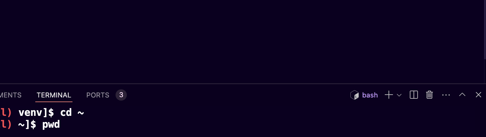

# Protip

## Terminal autocompletion
Tired of going through of your bash history and pressing up arrow key to find that one specific command? Use bash autocompletion
1. Create a file called `.inputrc` in your home directory (e.g., `/uoa/home/r04mr23/.inputrc`)
1. Copy and paste the following to the file
    ```txt title=".inputrc"
    "\e[A": history-search-backward
    "\e[B": history-search-forward
    ```
1. Save it and reload your terminal by creating a new terminal (it's the `+` button beside the `bash`)

1. Now whenever you're typing a command you can use up or down arrow key to search for the previous command that you used. Here's the example:
    ```bash
    # I typed `sba`
    [r04mr23@maxlogin1(maxwell) ~]$ sba

    # I pressed up arrow
    [r04mr23@maxlogin1(maxwell) ~]$ sbatch /uoa/home/r04mr23/sharedscratch/src/start_jupyter.sh benccchmarker-simulation

    # I pressed the up arrow again
    [r04mr23@maxlogin1(maxwell) ~]$ sbatch alignment_slurm.sh 
    ```

## Passwordless Auth to VS Code Remote
It can be annoying to have to reenter your Maxwell password every time you're trying to connect to it. Here's how you can bypass it:

1. Open terminal on your local pc
1. Generate [public and private keys](https://www.preveil.com/blog/public-and-private-key/) using OpenSSL, change `<local_user>` with your username (e.g., `r04mr23` for me)
    ```bash
    ssh-keygen -q -b 2048 -P "" -f /Users/<local_user>/.ssh/keys/maxlogin_rsa -t rsa
    ```
    This will output two files `maxlogin1_rsa` (private key) and `maxlogin1_rsa.pub` (publick key)
1. Update your ssh config located on `/Users/<localuser>/.ssh/config` (create one if you don't have) by adding the following, again change the `<local_user>` and `<remote_user>` with yours, usually they're the same for Maxwell
    ```txt file="/Users/<local_user>/.ssh/config"
    Host maxlogin1
    HostName maxlogin1.abdn.ac.uk
    User <remote_user>
    Port 22
    PreferredAuthentications publickey
    IdentityFile "/Users/<local_user>/.ssh/keys/maxlogin1_rsa"
    ```
1. Copy the content of the `maxlogin1_rsa.pub` to  `<remote_user_home_dir>/.ssh/authorized_keys` (in Maxwell it's `/uoa/home/<remote_user_name>/.ssh/authorized_keys` create one if it doesn't exist), your file should look like this now
    ```txt file="/uoa/home/<remote_user_name>/.ssh/authorized_keys"
    ssh-rsa AAAAB3NzaC1yc2EAAAADAQABAAACAQCxu/dOSNX1aRYB8Abl1Jbj0zFTwCCQBaXi/ZsWJS4mEX0RkXckItf2hf0O14PBZ8DdW9RS/zdadadasdaystdeyuasgdhjagjhdgashjdghjasdtyaatyuetyquegjhwqghjdaghjsdghsjagdhjagsdhjaghjdgahsjdghjastdyaudtyuatdyuatsyudtasyudtasyudryrqtyertyqwretfqghwefqgwhefghqfhegqfwgheqw m.ramdhani.23@abdn.ac.uk
    ```
1. Update the permission to `600` (File can only be accessed by you, inaccessible to everyone else)
    ```bash
    [r04mr23@maxlogin1(maxwell) ~]$ chmod 600 /uoa/home/<remote_user_name>/.ssh/authorized_keys
    ```
1. Now you can log in to VS Code without password!

## Automatically load slurm on every log in
Are you annoyed by the `bash: sbatch: command not found` error message every time you want to submit a job because you forget to do `module load slurm`? Adding it to your ~/.bashrc file will automatically load slurm
```bash
[r04mr23@maxlogin1(maxwell) ~]$ vim ~/.bashrc

# Press `shift + g + $` to go to the end of the line, press `i` then `enter` and type `module load slurm`
```