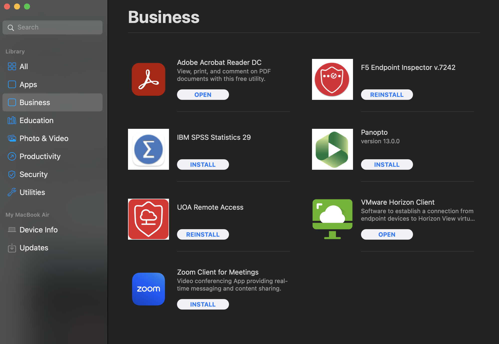
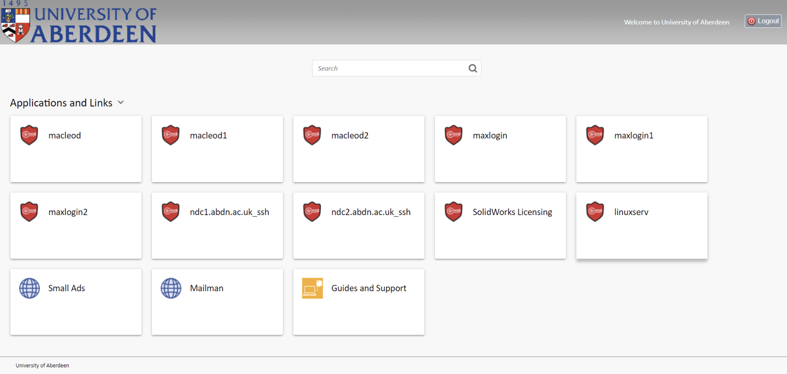
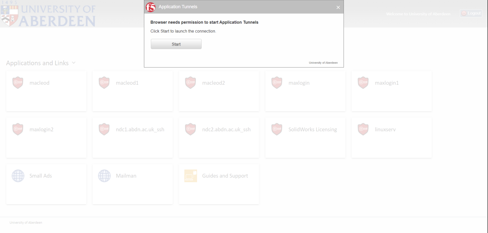
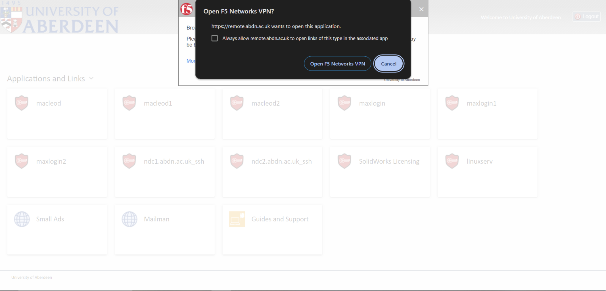
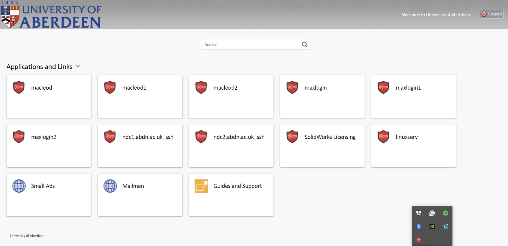

# Getting started

## Getting an account

To connect and log in to the HPC (referred to as Maxwell), you need to set up an account.

1. Fill out this [form](https://forms.office.com/Pages/ResponsePage.aspx?Host=Teams&lang=%7Blocale%7D&groupId=%7BgroupId%7D&tid=%7Btid%7D&teamsTheme=%7Btheme%7D&upn=%7Bupn%7D&id=rRkrjJxf1EmQdz7Dz8UrPwnct1uLpx5IjNgNRGJ4P6NUMU1WVDJZV0lLTFpJTUJHUjRQMUtEUkVXMiQlQCN0PWcu). The fields should be self-explanatory.
2. Wait for an email confirming that your account is ready. This usually takes 2-5 days.

## Installing VPN

If you want to connect to Maxwell and you're not using the university network, you may need to install a VPN.

### Macbook

1. Click the bee-like icon beside the Bluetooth icon on the menu bar.
    
1. Select `Business`.
    
1. Install UoA Remote Access.

### Non uni-managed devices

If you're using a device not managed by the university, you may not have access to the F5 VPN. However, you can use the Web VPN.

1. Go to [remote.abdn.ac.uk](https://remote.abdn.ac.uk).
1. Log in with your university account.
1. Click either `maxlogin1` or `maxlogin2` (These are your login nodes)
    
1. When the pop-up appears click start 
1. Another pop-up will appear and select `Open F5 Networks VPN`
    
1. Once you're connected, you will see the F5 VPN on the system tray
    

## Installing Git Bash
You may need Git Bash if you're not using a UNIX system (e.g., Windows but newer Windows has Powershell built in so you should be fine, but just in case)

### Windows
1. Download `git` standalone installer from [here](https://www.git-scm.com/download/win)
    - Make sure you're downloading the correct build based on your Windows system architecture (32/64-bit)
1. Install it
