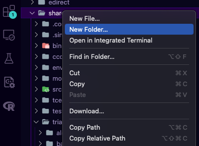
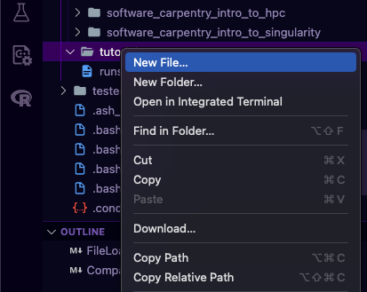
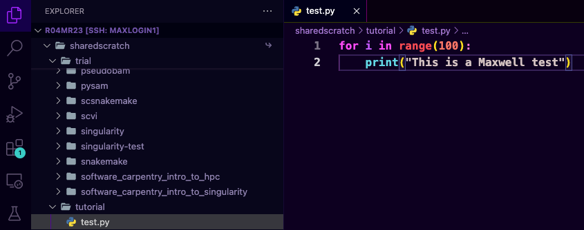
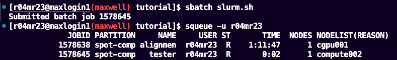
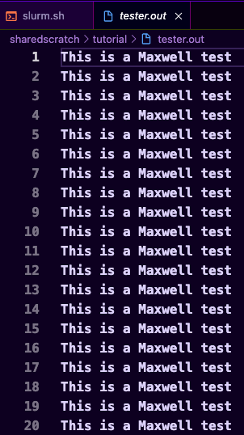

# Running a job

For this tutorial I'll be creating an empty folder called `tutorial` in my `sharedscratch`
- The VS Code way
    1. Right click on the `sharedscratch` folder and select `New Folder...`
    
    3. Name the folder `tutorial`

- Shell
    ```sh
    $ mkdir sharedscratch/tutorial
    ```

Let's say I want to run a Python script called `test.py` on Maxwell, it's just a simple script that will print `This is a Maxwell test` 100 times

```python
# sharedscratchtutorial/tutorial/test.py

for i in range(100):
    print("This is a Maxwell test")
```

- The VS Code way
    1. Create a new file by right clicking on the `tutorial` folder 
    
    2. Name the file `test.py`
    3. Copy and paste the code above to the file
    
    4. Save the file by pressing `CTRL+S` on Windows or `⌘`+ `s` on Mac
    5. You can open a terminal `CTRL` + \` on Windows or `⌃` + \` on Mac, then run the code by typing `python test.py` and should be working smoothly for something small like this, but in reality you'll be working with much bigger stuff and its not recommended to run your whole pipeline on a login node, so instead of doing that we will use SLURM
    6. Create a new file called `slurm.sh` in the same directory as your `test.py`
    7. Paste the following blocks of code to the `slurm.sh`
    
        ```sh
        #!/bin/bash
        #SBATCH --job-name=tester
        #SBATCH -o tester.out
        #SBATCH --ntasks=1
        #SBATCH --mail-type=begin
        #SBATCH --mail-type=end
        #SBATCH --mail-user=m.ramdhani.23@abdn.ac.uk

        python test.py
        ```
    
        The first line is called the shebang it specifify the interpreter to be used to run the code, next lines starting with `#SBATCH` are the special instructions we'll use to interact with the Slurm Workload Manager
        - `--job-name`: Name for the job
        - `--o`: Output log
        - `--ntasks`: Number of tasks to be executed in parallel
        - `--mail-..`: Send a mail when the job starts running and when the job is finished to `--mail-user` email address
    
    8. Once we're set we can run the code from the terminal
    ```sh
    # Change the directory if you haven't done so
    $ cd sharedscratch/tutorial

    # Run the script
    $ sbatch slurm.sh
    ```
    9. You can check the status of the job by using `squeue -u <YOUR_USER_ID>` 
    10. You can also see the log once your job starts running in a file called `tester.out`

- Shell
    ```sh
    $ cd sharedscratch/tutorial
    
    $ vim test.py
    ```

    `esc` then `i` to insert text, `ctrl` + `v` to paste the python code, save it by pressing `esc` then `w` then `q` and enter to save file

    ```sh
    vim slurm.sh
    ```

    Do the same thing above but this time paste the code for `slurm.sh` and save it

    ```sh
    $ sbatch slurm.sh
    $ squeue -u <YOUR_USERNAME>
    ```

When running your job you might feel like you want to update your script or stop the already running job to do this you can use `scancel <JOB_ID>` `JOB_ID` of your job can be found on the first column when you run `squeue -u <YOUR_USERNAME>`

More resources:
- [Bioinformatics Workbook's Quick Reference Sheet for HPC](https://bioinformaticsworkbook.org/Appendix/HPC/SLURM/slurm-cheatsheat.html)
- [USC's HPC Cheatsheet](https://www.carc.usc.edu/user-information/user-guides/hpc-basics/slurm-cheatsheet)
- [Slurm Workload Manager Documentation](https://slurm.schedmd.com/documentation.html)
    


