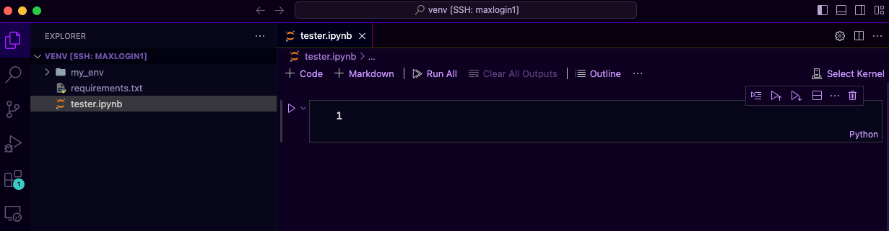
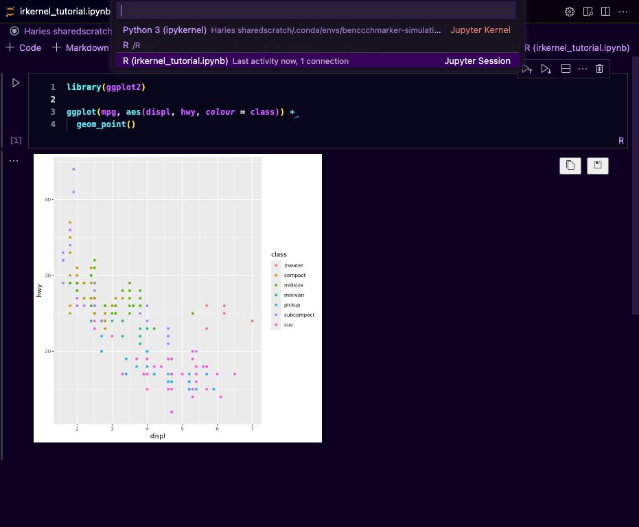

# Running a Jupyter Server

## Introduction
Jupyter notebook is very handy for fast-prototyping or quick Python code testing. In this guide, we will be using VS Code to create a Jupyter Server and run Jupyter notebook on Maxwell. Before starting please make sure you have installed the following:
- [Visual Studio Code](https://code.visualstudio.com/download)
- [VS Code Jupyter extension](https://marketplace.visualstudio.com/items?itemName=ms-toolsai.jupyter)

Every file with `.ipynb` extension will be detected as a Jupyter notebook file, you can create a file and put a `.ipynb` extension and it will become a Jupyter notebook


To start working with Jupyter notebook you will need to select a kernel 

There are two options, you can use the readily available environments (Maxwell default conda environments, your conda environments or your pip environments if you're in the same directory with it). The problem with selecting this option is the fact that you will be using login node which is very slow and may fail because of you don't have enough memory to run your script. Most of the time we will opt for the second choice, to use the Existing Jupyter server.

## Creating Jupyter server
To create a Jupyter server we need to submit a slurm job that handles the running of Jupyter server in the background for us
```bash title="start_jupyter.sh"
#!/bin/bash
#SBATCH --time=01:00:00
#SBATCH --cpus-per-task=8
#SBATCH --ntasks=1
#SBATCH --mem=64G
#SBATCH --job-name=jupyter-notebook
#SBATCH --output=jupyter-notebook.log

module load mamba
source ~/.bash_profile
source ~/.bashrc

mamba activate my_environment
jupyter notebook --no-browser --ip=0.0.0.0
```

Change `#SBATCH` options according to your need, in my case I need 64 GB memory, with 8 CPUs per task and keep it running for the next 1 hour. If you're not sure with the `#SBATCH` option or you want to add more option, you can refer to [this](https://slurm.schedmd.com/sbatch.html). The next lines I'm loading `mamba`, my `bash_profile` and setup (The reason was if I remember it correctly because if I don't do it it will use the default `base` environment that may cause clash with the package dependencies installed in my environment, so yes it's better to include them). The lines that follow is to activate my environment (**NOTE**: You must have `ipykernel` package installed in your environment otherwise the server creation will fail) and to create a Jupyter notebook server.

Once you submit the job, the log will appear (in my case `jupyter-notebook.log`) wait for around 2 or 3 minutes till the log file is filled with Jupyter logs (Either server is fully running or it's failed). Open the `jupyter-notebook.log`, if it's successful you will see the url to the server.


Copy the url, the one that doesn't start with the `http://127.0.0.1......` (in my case it's `http://vhmem002.int.maxwell.abdn.ac.uk:8888/tree?token=fac698f887a93963b6b7f860158e2e83ce5f03b4281978e6`)


Go back to your Jupyter notebook, click `Select Kernel` and select `Existing Jupyter Server...`, paste the url, press enter and when prompted with environment selection, select your environment (There is only one of it).

## Running R code on Jupyter Notebook
To run R code on Jupyter Notebook you need to have the following library installed in the environment that you're using
```
mamba install r-irkernel r-languageserver
```

If you have them installed, you can follow the same steps you did above but now instead of `Python 3` you need to select `R` when selecting the kernel



## More resources
- [Visual Studio Code's Jupyter Notebooks in VS Code](https://code.visualstudio.com/docs/datascience/jupyter-notebooks)