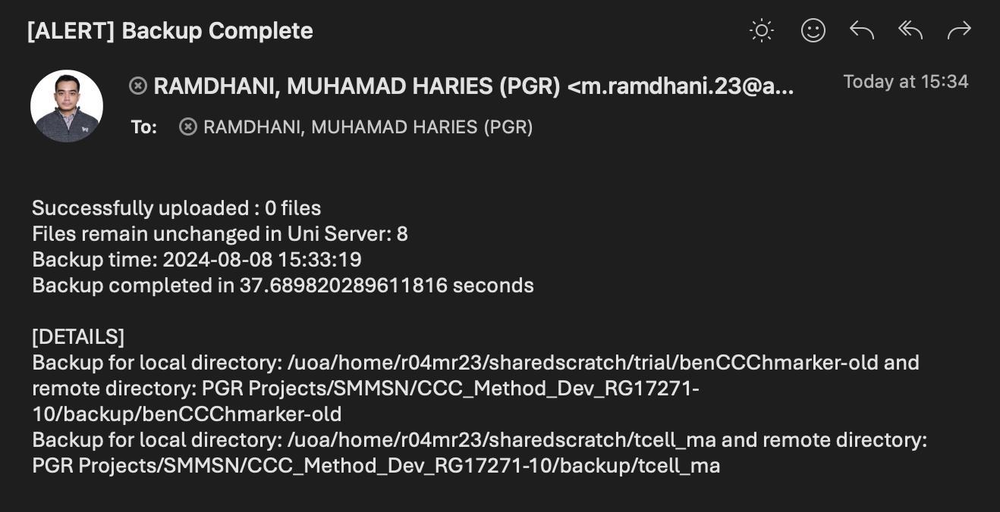

Oh no Maxwell went down for a week because of some maintenance and all of my files are on Maxwell, what I am gonna do now? ~~Of course I'm gonna spend the rest of the week playing my favorite RPG~~

OK but jokes aside, we need to back our files up somewhere just in case in the future Maxwell went down again and we won't have access to our files on Maxwell. Technically the easiest way would be just to back all of our files to our local computer, which we can directly do use the magic `rsync`. However, this comes with a problem as local computers typically have a ROM of 250 GB to 1TB. Another problem is that you may need to run `rsync` manually as your local computer isn't always on 24/7. Luckily, we have the uni storage (For this one I got another 6TB of storage ~~because we purchased it~~) where we can store our research files and data. The thing with the uni storage is, it's ran on Windows, so we have limited commands in which we can't directly use the magical `rsync` and we have to use `smbclient`. In this post I am going to explain how we can implement smart backup between Maxwell and the Uni server.

The whole thing is implemented in Python and using CRON as the scheduler. For now it's Unidirectional, only Maxwell --> Uni Server (Implementing the Bidirectional isn't really hard but I don't think I'm using it now).

## The Logic
The logic should be simple and straightforward,
1. Recursively list all of the files and the subdirectories in target directories both in Maxwell and Uni Server (I will address Maxwell as LOCAL and Uni Server as REMOTE, technically you can use it interchangably but since we're talking about unidirectionality, I'll address it that way)
2. Compare both of directories based on the filename and size (technically the best way is to also compare the date modified/created but it's a bit tricky as it changes after transfer, so I'm ignoring it for now)
3. If the file doesn't exist in the Uni Server send it from Maxwell
4. Send an email alert to the user once backup complete
5. Schedule the script depending on our preferred frequency using CRON

## Files needed
### Backup config

This is the main file that controls the overall backup, you can store this file wherever you want to

- `name`: Name of the smartbackup, will affect the naming of the logs etc.
- `server`: The uni server where the files are stored
- `log_path`: Path to store the logs of the backup
- `credential_file`: File containing your SMB credentials, it looks like this

    ```txt title=".smbcredentials"
    username=r04mr23
    password=YOUR_PASSWORD
    ```
    Replace r04mr23 with your UNI ID and YOUR_PASSWORD with your password
- `notify_me`: TRUE if you want to be sent an email notification when the backup process ends, FALSE otherwise
- `notify_from`: From whom will the email be sent, just enter your email ~~or if you're feeling like it you can enter any emails of the people that has `abdn.ac.uk` email address and it will still work~~
- `notify_name`: Name of the email sender ~~again you can use anyone's name~~
- `notify_to`: To whom will the email be sent, each new line of dash represents one email recepient just add more lines and more receipients if you want to
- `to_backups`: List of directory to be backed up
    - `local_directory`: Maxwell directory to be backed up
    - `remote_directory`: Uni server directory where you want the files stored
    - `exclude`: Files to exclude
    - `remove_from_local`: Remove the files from Maxwell after backup

    If you want to back up more directory just add more lines starting with `-` must include `local_directory` and `remote_directory` variables otherwise it will fail 

```yaml title="smartbackup_config.yaml"
name: backup
server: //uoa.abdn.ac.uk/global
log_path: /uoa/home/r04mr23/smartbackup_logs
credential_file: /uoa/home/r04mr23/.smbcredentials
notify_me: TRUE
notify_from: m.ramdhani.23@abdn.ac.uk
notify_name: RAMDHANI, MUHAMAD HARIES (PGR)
notify_to: 
  - m.ramdhani.23@abdn.ac.uk

to_backups:
  - local_directory: /uoa/home/r04mr23/sharedscratch/trial/benCCChmarker-old
    remote_directory: PGR Projects/SMMSN/CCC_Method_Dev_RG17271-10/backup/benCCChmarker-old
    exclude:
      - ignore_me.txt
      - ignore_please
      - ethel_cain.txt
    remove_from_local: FALSE
  - local_directory: /uoa/home/r04mr23/sharedscratch/tcell_ma
    remote_directory: PGR Projects/SMMSN/CCC_Method_Dev_RG17271-10/backup/tcell_ma
    remove_from_local: FALSE
```

### Python script
This the Python file which is responsible for the backup process from file comparison to emailing you the alert (I'll add more comments later) but should be straightforward

```python title="smarbackup.py"
import logging
import os
import smtplib
import sys
import time
import yaml
from email.utils import formataddr

import pandas as pd

def load_config(config_path):
    with open(config_path) as f:
        return yaml.safe_load(f)

def setup_logging(log_path, name):
    os.makedirs(log_path, exist_ok=True)
    logging.basicConfig(
        filename=f"{log_path}/{name}_log.log",
        level=logging.DEBUG,
        format='%(asctime)s - %(levelname)s - %(message)s'
    )

def list_files_recursive(directory):
    all_files = []
    for root, dirs, files in os.walk(directory):
        os_command = f"ls {root} -l --time-style=full-iso"
        result = os.popen(os_command).read()
        lines = result.splitlines()

        for line in lines[1:]:  # Skip the first line
            parts = line.split()
            if len(parts) > 8:
                file_info = {
                    'permissions': parts[0],
                    'links': parts[1],
                    'owner': parts[2],
                    'group': parts[3],
                    'group_2': parts[4],
                    'size': parts[5],
                    'date': parts[6],
                    'time': parts[7],
                    'timezone': parts[8],
                    'filename': os.path.join(root, ' '.join(parts[9:]))
                }
                all_files.append(file_info)
    return all_files

def list_remote_files_recursive(remote_directory, base_path, server, credential_file, log_path):
    all_files = []
    os_command = f"smbclient '{server}' -D '{remote_directory}' -A {credential_file} -c \"ls\" > {log_path}/remote_files.txt"
    os.system(os_command)

    try:
        with open(f'{log_path}/remote_files.txt') as f:
            lines = f.readlines()

        for line in lines:
            parts = line.split()
            if len(parts) >= 8:
                full_path = os.path.join(base_path, parts[0])
                file_info = {
                    'filename': full_path,
                    'type': parts[1],
                    'size': parts[2],
                    'day': parts[3],
                    'month': parts[4],
                    'date': parts[5],
                    'time': parts[6],
                    'year': parts[7]
                }
                all_files.append(file_info)

                if parts[1] == 'D' and parts[0] not in ['.', '..']:
                    subdirectory = os.path.join(remote_directory, parts[0])
                    all_files.extend(list_remote_files_recursive(subdirectory, full_path, server, credential_file, log_path))
    except Exception as e:
        logging.error(f"Error reading remote files: {e}")

    return all_files

def process_files(local_directory, remote_directory, server, credential_file, log_path, excludes):
    try:
        files = list_files_recursive(local_directory)
        local_files_df = pd.DataFrame(files, columns=[
            'permissions', 'links', 'owner', 'group', 'group_2', 'size', 'date', 'time', 'timezone', 'filename'
        ])

        local_files_df["filename"] = local_files_df["filename"].str.replace(local_directory, "")
        local_files_df = local_files_df.sort_values(["permissions", "filename"], ascending=[False, True]).reset_index(drop=True)
        local_files_df.loc[local_files_df["permissions"].str.startswith("d"), "size"] = 0

        for to_exclude in excludes:
            local_files_df = local_files_df.query(f"~filename.str.contains('{to_exclude}')", engine='python')

    except Exception as e:
        logging.error(f"Error processing local files: {e}")

    try:
        files = list_remote_files_recursive(remote_directory, remote_directory, server, credential_file, log_path)
        remote_files_df = pd.DataFrame(files, columns=[
            'filename', 'type', 'size', 'day', 'month', 'date', 'time', 'year'
        ])

        remote_files_df = remote_files_df.query("~filename.str.contains('/\.')")
        remote_files_df = remote_files_df.query("~filename.str.contains('.DS_Store')", engine='python')
        remote_files_df = remote_files_df.query("type != 'blocks'")

        remote_files_df["filename"] = remote_files_df["filename"].str.replace(remote_directory, "")
        remote_files_df.loc[remote_files_df["type"] == "D", "size"] = 0

    except Exception as e:
        logging.error(f"Error processing remote files: {e}")

    local_files = (local_files_df["filename"] + "---" + local_files_df["size"].apply(str)).to_list()
    remote_files = (remote_files_df["filename"] + "---" + remote_files_df["size"].apply(str)).to_list()
    total_files_to_upload = len(set(local_files) - set(remote_files))
    total_files_unchanged = len(set(local_files).intersection(set(remote_files)))

    logging.info(f"Files to upload: {total_files_to_upload}")
    logging.info(f"Files remain unchanged in Uni Server: {total_files_unchanged}")

    for index, local_file in local_files_df.iterrows():
        remote_match = remote_files_df[
            (remote_files_df['filename'] == local_file['filename']) &
            (remote_files_df['size'] == local_file['size'])
        ]

        if remote_match.empty:
            try:
                if local_file["permissions"].startswith("d"):
                    os.system(f"smbclient '{server}' -D '{remote_directory}' -A {credential_file} -c \"mkdir {local_file['filename']}\"")
                    logging.info(f"Created remote directory: {local_file['filename']}")

                if local_file["permissions"].startswith("-"):
                    os.system(f"cd {local_directory}; smbclient '{server}' -D '{remote_directory}' -A {credential_file} -c \"put {local_file['filename'][1:]}\"")
                    logging.info(f"Uploaded file: {local_file['filename']}")
            except Exception as e:
                logging.error(f"Error syncing file {local_file['filename']}: {e}")

    return total_files_to_upload, total_files_unchanged

def send_notification(notify_from, notify_name, notify_to, all_total_files_to_upload, all_total_files_unchanged, backup_time, duration, to_backup_dirs):
    from_addr = notify_from
    from_name = notify_name
    to_addrs  = notify_to

    formatted_from = formataddr((from_name, from_addr))
    formatted_to = ", ".join(to_addrs)

    lines = [
        f"From: {formatted_from}",
        f"To: {formatted_to}",
        f"Subject: [ALERT] Backup Complete",
        "",
        f"Successfully uploaded : {all_total_files_to_upload} files",
        f"Files remain unchanged in Uni Server: {all_total_files_unchanged}",
        f"Backup time: {backup_time}",
        f"Backup completed in {duration} seconds\n",

        "[DETAILS]"
    ]

    for to_backup_dir in to_backup_dirs:
        lines.append(f"Backup for local directory: {to_backup_dir['local_directory']} and remote directory: {to_backup_dir['remote_directory']}")

    msg = "\r\n".join(lines)

    with smtplib.SMTP("mailhub.abdn.ac.uk") as server:
        server.set_debuglevel(1)
        server.sendmail(from_addr, to_addrs, msg)

    logging.info("Email notification sent successfully")

def main():
    if len(sys.argv) != 2:
        print("Usage: python smartbackup.py <path>")
        sys.exit(1)

    config_path = sys.argv[1]
    config = load_config(config_path)
    
    BACKUP_LOG_PATH = config['log_path']
    name = config["name"]
    to_backup_dirs = config["to_backups"]
    server = config["server"]
    credential_file = config["credential_file"]
    notify_me = config["notify_me"]
    
    notify_from = config["notify_from"]
    notify_to = config["notify_to"]
    notify_name = config["notify_name"]

    today = pd.Timestamp.now().strftime("%Y-%m-%d %H:%M:%S")
    setup_logging(BACKUP_LOG_PATH, name)

    start_time = time.time()

    all_total_files_to_upload = 0
    all_total_files_unchanged = 0

    for to_backup_dir in to_backup_dirs:
        local_directory = to_backup_dir['local_directory']
        remote_directory = to_backup_dir['remote_directory']
        excludes = to_backup_dir.get("excludes", [])

        total_files_to_upload, total_files_unchanged = process_files(
            local_directory, remote_directory, server, credential_file, BACKUP_LOG_PATH, excludes
        )

        all_total_files_to_upload += total_files_to_upload
        all_total_files_unchanged += total_files_unchanged

        logging.info(f"Backup completed for local directory: {local_directory} and remote directory: {remote_directory}")

    stop_time = time.time()

    logging.info(f"Backup completed in {stop_time - start_time} seconds")

    if notify_me:
        send_notification(
            notify_from, notify_name, notify_to, total_files_to_upload, total_files_unchanged, today, stop_time - start_time, to_backup_dirs
        )

if __name__ == "__main__":
    main()
```

### New environment (Optional)
Technically you don't really need this but since we care about reproducible research and just to make sure you don't mess up with your other packages this will be the best way. You will only need to install `pandas` for this as the other libraries are python built-in libraries (also before anyone coming at me, tehcnically we also don't need `pandas` but I'm using it for the sake of faster prototyping)

1. Create a new environment
    ```bash
    [r04mr23@maxlogin1(maxwell) ~]$ python -m venv smbvenv
    ```
2. Activate it and install pandas
    ```bash
    [r04mr23@maxlogin1(maxwell) ~]$ source bin/activate/smbvenv
    (smbvenv) [r04mr23@maxlogin1(maxwell) ~]$ pip install pandas
    ```
3. Check where your Python is located, we will use this one later
    ```bash
    (smbvenv) [r04mr23@maxlogin1(maxwell) ~]$ which python
    /uoa/scratch/users/r04mr23/trial/smb_test_data/smbvenv/bin/python
    ```

## Setting everything up
Note that you can place all of the above wherever you want. What's left right now is to set the cron job

1. Open crontab editor, it will open a vim editor for you
    ```bash
    [r04mr23@maxlogin1(maxwell) ~]$ crontab -e
    ```

    Something that looks like this
    ```txt
    ~
    ~
    ~
    ~
    "/tmp/crontab.vR7AY1" 0L, 0C
    ```
2. Press `ESC` then `i` keys to start writing your cron job
    ```
    0 6 * * 0 /uoa/scratch/users/r04mr23/trial/smb_test_data/smbvenv/bin/python /uoa/home/r04mr23/sharedscratch/src/smartbackup.py /uoa/home/r04mr23/smartbackup_config.yaml
    ```

    If you're not familiar with cron job:
    - `0 6 * * 0`: How frequent you want the job to run, in my case it's every week at 6AM, if you wanna learn more about this you can check [crontab.guru](https://crontab.guru/)
    - `/uoa/scratch/users/r04mr23/trial/smb_test_data/smbvenv/bin/python`: Python binary path
    - `/uoa/home/r04mr23/sharedscratch/src/smartbackup.py`: Smart backup Python script
    - `/uoa/home/r04mr23/smartbackup_config.yaml`: The configuration file
3. You will be able to see the logs on the path that you specified, for example this is how mine looks like
    ```log title="backup_log.log"
    2024-08-08 14:38:13,058 - INFO - Processing backup for local directory: /uoa/home/r04mr23/sharedscratch/trial/smb_test_data/backup_test and remote directory: PGR Projects/SMMSN/CCC_Method_Dev_RG17271-10/test/backup_test
    2024-08-08 14:38:18,376 - INFO - Files to upload: 0
    2024-08-08 14:38:18,378 - INFO - Files remain unchanged in Uni Server: 16
    2024-08-08 14:45:50,973 - INFO - Processing backup for local directory: /uoa/home/r04mr23/sharedscratch/trial/smb_test_data/backup_test and remote directory: PGR Projects/SMMSN/CCC_Method_Dev_RG17271-10/test/backup_test
    2024-08-08 14:45:56,277 - INFO - Files to upload: 0
    2024-08-08 14:45:56,278 - INFO - Files remain unchanged in Uni Server: 16
    ....
    ```
4. You will also get an email notification if your `notify_me` variable is set to `TRUE`
    

And that's it on how to backup your data from Maxwell to Uni Server, I'll add more functionalities in the future when I feel the need to


