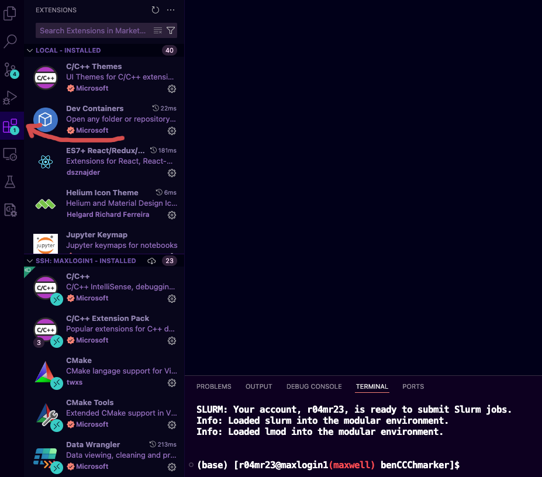
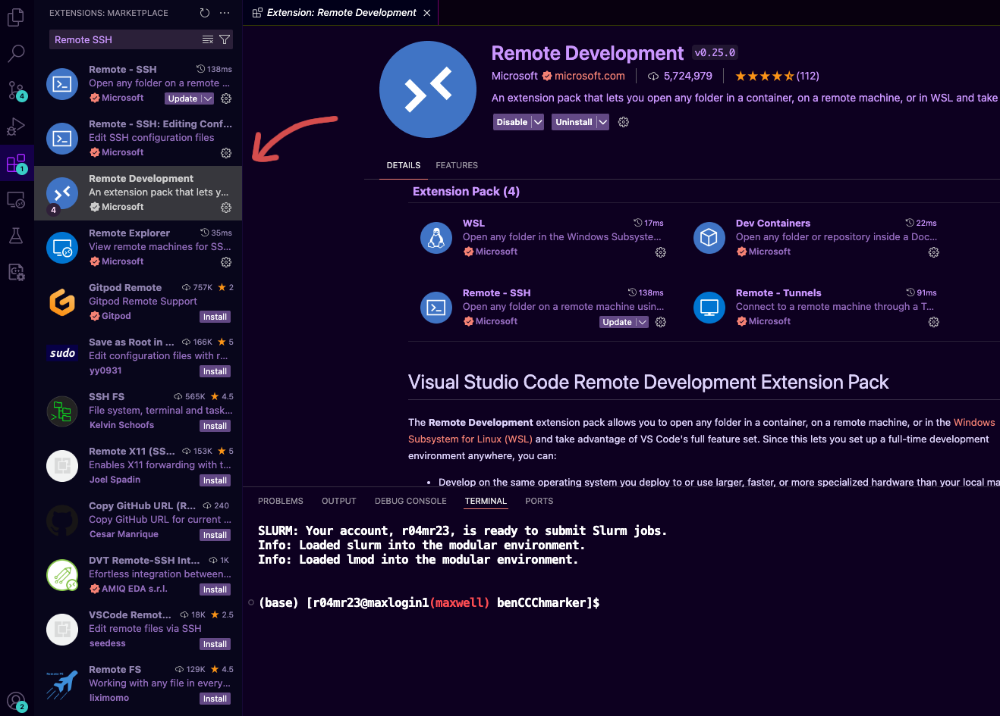
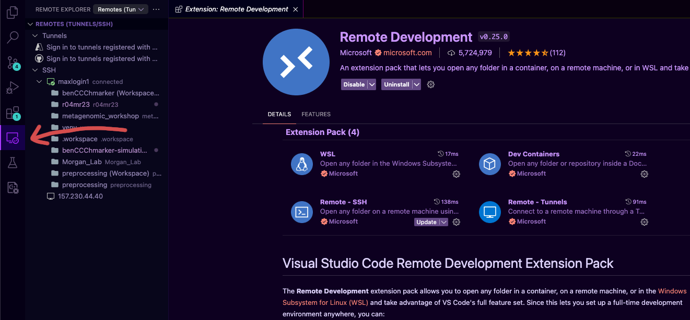
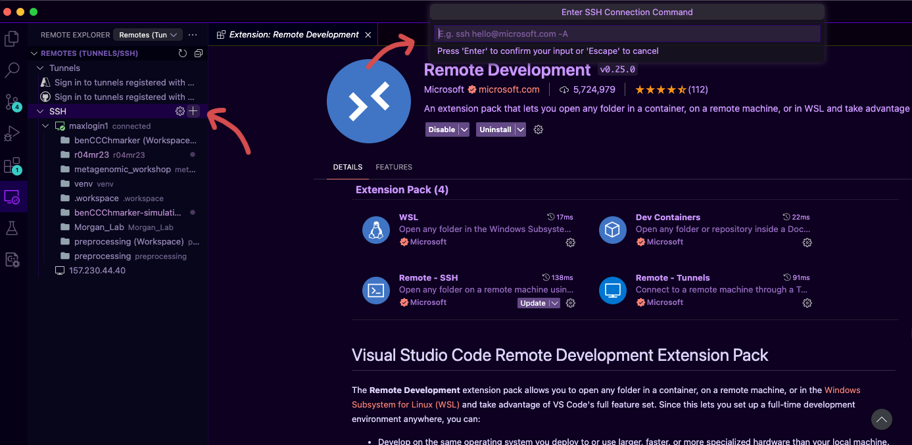
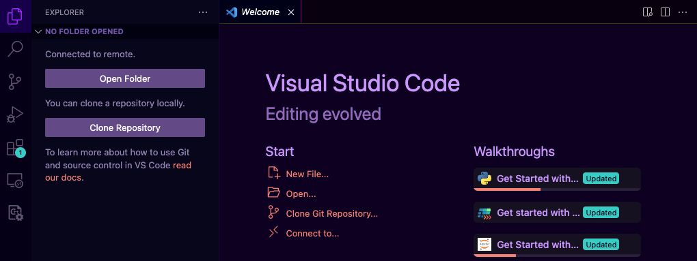
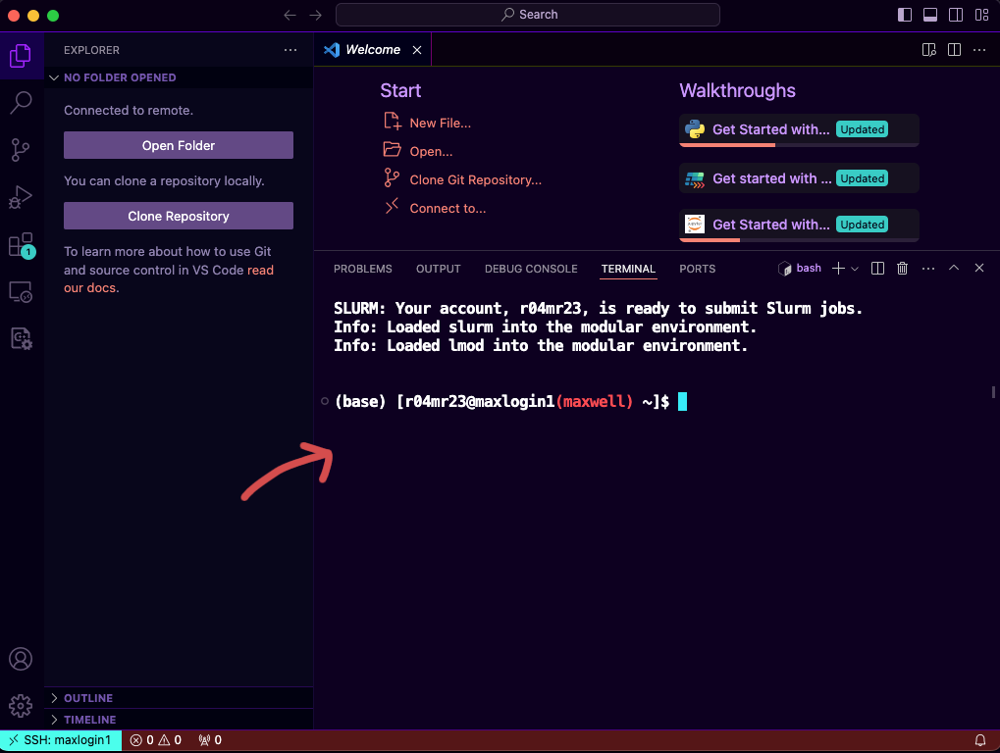

# Using Maxwell
There are several ways on how you can connect to Maxwell

## Command line/Terminal/Command Prompt/Powershell
- **Windows**: Type `cmd` or `powershell` on the explorer near the start bar. 
- **Mac**: `⌘`+ `space`, then type `terminal`
- **Linux**: `ctrl`+`alt`+`t`

You can use ssh to connect to Maxwell, there are two login nodes that you can use `maxlogin1.abdn.ac.uk` and `maxlogin2.abdn.ac.uk`. You can use your id (For example my ID is `r04mr23`) and password to connect to Maxwell.

```bash
ssh r04mr23@maxlogin1.abdn.ac.uk
```

It may show you this message
```
The authenticity of host 'maxlogin1.abdn.ac.uk' can't be established.
ECDSA key fingerprint is SHA256:CwrcHjdd9349u38rj392fr9j389rj3298rj23.
Are you sure you want to continue connecting (yes/no/[fingerpint])
```
For now to not complicate things just type `yes` and you're good to go!

### First time using HPC/Terminal/Command line?
If you're using HPC/Terminal/Command line for the first time, here are some guides that might be useful for you:

- [Software Carpentry's Intro to Unix Shell](https://swcarpentry.github.io/shell-novice/)
- [Carpentries Incubator's Intro to HPC](https://carpentries-incubator.github.io/hpc-intro/)
- [Alexji's UNIX cheatsheet](https://www.alexji.com/UNIXCheatSheet.pdf)
- [Bioinformatics Workbook's UNIX basics](https://bioinformaticsworkbook.org/Appendix/Unix/unix-basics-1.html)

There are probably more tutorials that better suit your liking if you Google and look for `unix tutorial site:github.io`

## VS Code Remote SSH Extension
> "Tools amplify your talent. The better your tools, and the better you know how to use them, the more productive you can be. Start with a basic set of generally applicable tools. As you gain experience, and as you come across special requirements, you’ll add to this basic set. Like the craftsman, expect to add to your toolbox regularly. Always be on the lookout for better ways of doing things. If you come across a situation where you feel your current tools can’t cut it, make a note to look for something different or more powerful that would have helped. Let need drive your acquisitions."
>
> — Andy Hunt, The Pragmatic Programmer

Terminal is powerful but sometimes you just want to prototype things faster and more efficient (which honestly if you're some sort of UNIX gods you'd probably be able to do it but I'm not) in more user-friendly environment, not to mention the painful process of transferring files using scp and sftps, well technically you can use FileZilla or PUTTY for it but why bother switching back and forth between two softwares when you can have all them in one. VS Code got your back, it offers a graphical user interface (GUI) that lets you edit code, run a terminal, and leverage thousands of extensions to streamline development. To use VS code;

1. Download [VS Code](https://code.visualstudio.com/download) (Don't confuse it with Microsoft's other product called Visual Studio) 
2. Install it (of course)
3. Open it and click the Extension icon on the left side pane

4. Search for Remote Development extension pack and install it, this will install all of the required extensions for SSH VS Code remote development

5. Once you have it installed you will have the Remote Explorer option under the Extension icon, click it

6. Hover over SSH and Click the New Remote (`+`) button

7. Type the ssh login, press `enter` (Change `r04mr23` with your id, because it's mine)
    ```
    ssh r04mr23@maxlogin1.abdn.ac.uk
    ```
8. It will ask you what kind of operating system, select `Linux`
9. Now when you click the Explorer icon on the left side pane (or `⇧⌘E`), you can select which directory you want to open

10. `⌃` + `\`` will open the terminal for you


Happy exploring and becoming more productive. More on VS Code and the Remote Explorer extension
- [Microsoft's Visual Studio Code Basics](https://code.visualstudio.com/docs/introvideos/basics)
- [Microsoft's Remote Development using VS Code](https://code.visualstudio.com/docs/remote/ssh)

## Other resources
- [Aiden Durrant's Machine Learning Guide for UoA HPC Clusters](https://github.com/AidenDurrant/abdn-hpc)
- [Maxwell's User Manual](https://www.abdn.ac.uk/it/documents-uni-only/OCF-User0-Manual-Abderdeen-Maxwell.pdf)