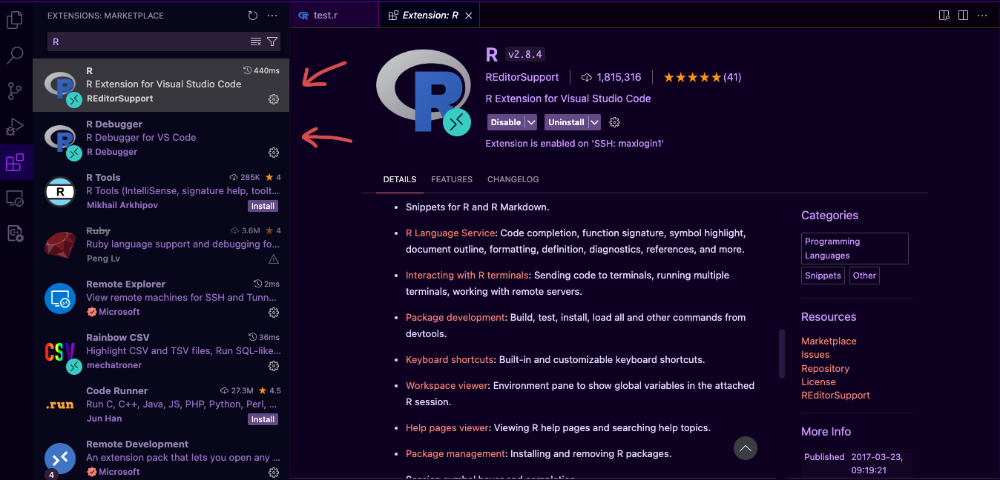
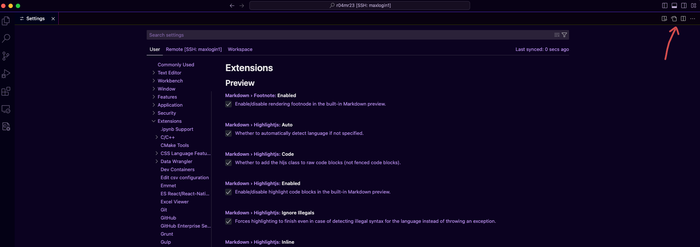
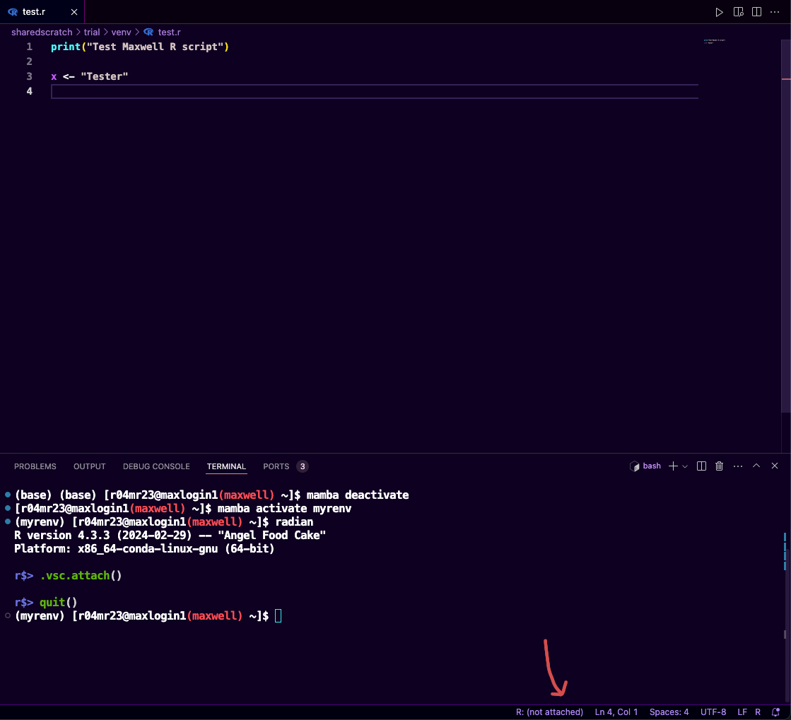
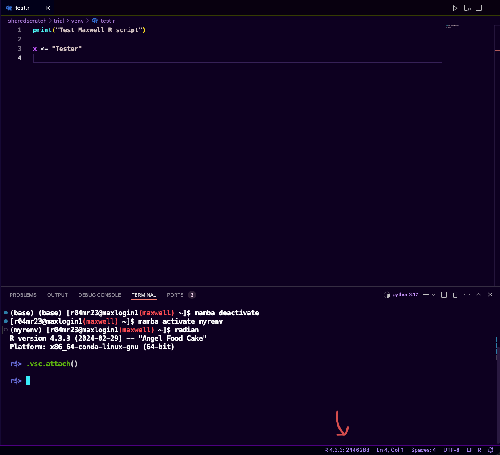
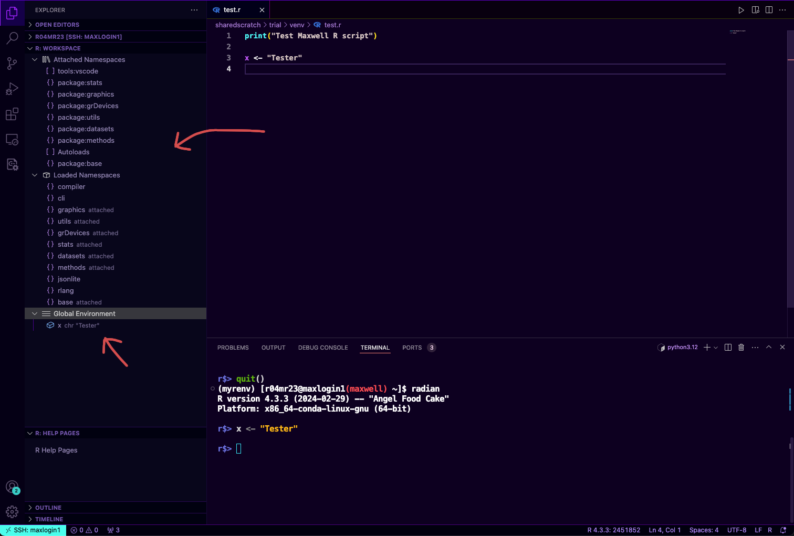
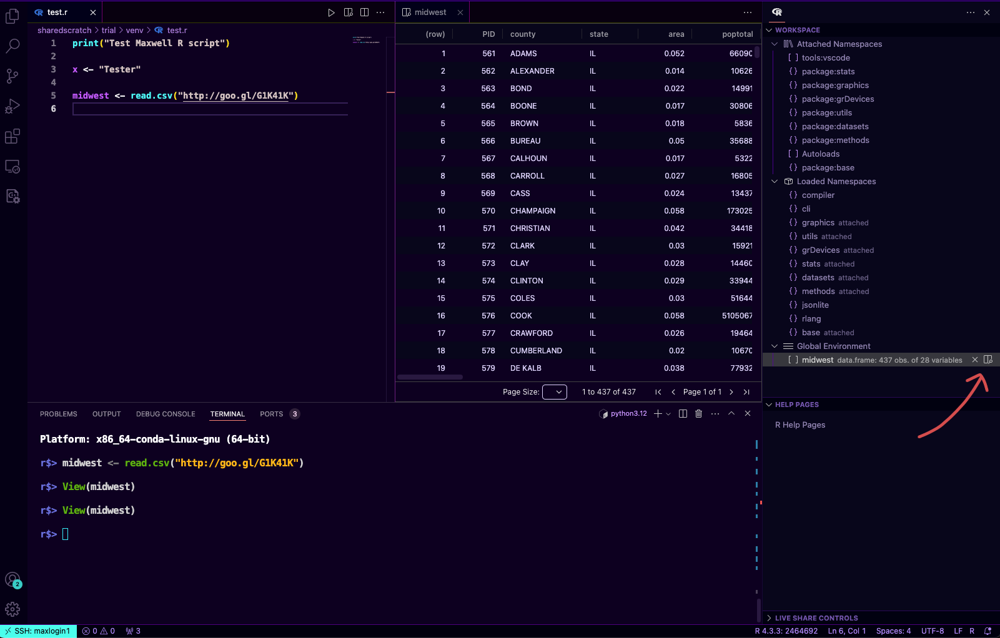
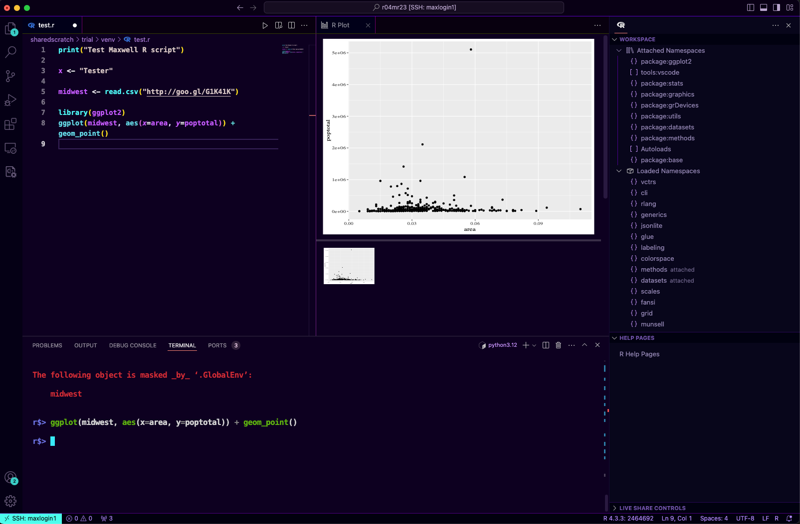

# Working with R

From time to time you may be required to work with R script as most of the bioinformatics/computational biology packages are written in R (need citation). In your local computer, working with R may appear fairly easy as you can always install [RStudio Desktop](https://posit.co/download/rstudio-desktop/) and execute your R script there. But what if you want to run a script that requires high memory and your computer doesn't have enough RAM? Yes you can always rely on Maxwell! It's pretty straightforward to work with R on HPC as you can just create a ready-to-run R script and run it using the `Rscript` command.

```bash
Rscript myscript.R
```

With VS Code you can do more than just running the script, you can also enter an interactive mode that will ease development and analysis (basically like using RStudio but on Maxwell and with powerful tooling that VS Code extension offers). So here's how we can do it:
1. Open your terminal (`ctrl` + `) and create a new conda/mamba environment and activate it
    ```bash
    [r04mr23@maxlogin1(maxwell) ~]$ mamba create -n myrenv
    [r04mr23@maxlogin1(maxwell) ~]$ mamba activate myrenv
    (myrenv) [r04mr23@maxlogin1(maxwell) ~]$
    ```
1. Install the R and R Debugger extensions for VS Code
    
1. In order for VS Code R to work you have to install the following packages
    Mandatory:
        - `R`: The R programming language itself
        - [r-httpgd](https://github.com/nx10/httpgd): Required for VS Code interactive plot viewer to work
        - [radian](https://github.com/randy3k/radian): A better R terminal
        - [r-languageserver](https://github.com/REditorSupport/languageserver): Required for VS Code to provide code completion, dignostics, formatting and any more features
        - [r-jsonlite](https://cran.r-project.org/web/packages/jsonlite/index.html): Relatively fast jsonparser for statistical data and the web
        - [r-irkernel](https://github.com/IRkernel/IRkernel): R Kernel for Jupyter
    Not mandatory but will be used for this guide:
        - [r-ggplot2](https://ggplot2.tidyverse.org/): Data visualisation
        - [r-dplyr](https://dplyr.tidyverse.org/): Data manipulation
    
    <br/>
    ```bash
    (myrenv) [r04mr23@maxlogin1(maxwell) ~]$ mamba install R radian r-httpgd r-lang r-jsonlite r-languageserver r-irkernel r-ggplot2 r-dplyr
    ```
1. Open the `settings.json`  by pressing `command` + `,` or Code -> Settings... -> Setting and click the icon pointed below

    

1. Update `settings.json` file by adding the following parameters
    ```json
    "r.rterm.linux": "/uoa/home/r04mr23/sharedscratch/.conda/envs/myrenv/bin/radian",
    "r.alwaysUseActiveTerminal": true,
    "r.sessionWatcher": true,
    "r.rpath.linux": "/uoa/scratch/users/r04mr23/.conda/envs/myrenv/bin/R"
    ```

    Replace `r.term.linux` and `r.rpath.linux` with the path where R and radian installed in your environment. If you're not sure, in the environment that you activated check using the following
    ```bash
    (myrenv) [r04mr23@maxlogin1(maxwell) ~]$ which radian | xargs readlink -f
    /uoa/scratch/users/r04mr23/.conda/envs/myrenv/bin/radian
    (myrenv) [r04mr23@maxlogin1(maxwell) ~]$ which R | xargs readlink -f
    /uoa/scratch/users/r04mr23/.conda/envs/myrenv/bin/R
    ```

    Copy the path, update your `settings.json`, save it (`ctrl`/`command` + `s`) and close it

1. Turn on the session watcher this will allow the communication between VS Code R and R Live session by performing the following commands (Read more on [here](https://github.com/REditorSupport/vscode-R/wiki/R-Session-watcher#advanced-usage-for-self-managed-r-sessions))
    - Edit the `.Rprofile` on your home directory
        ```R
        (myrenv) [r04mr23@maxlogin1(maxwell) ~]$ vim ~/.Rprofile
        ```
    - Append the following code to it
        ```R
        if (interactive() && Sys.getenv("RSTUDIO") == "") {
            source(file.path(Sys.getenv(if (.Platform$OS.type == "windows") "USERPROFILE" else "HOME"), ".vscode-R", "init.R"))
        }
        ```
    - Reload your terminal

1. In the directory of your choice create a new R script `test.R` and copy the code below
    ```R title="test.R"
    print("Test Maxwell R script")

    x <- "Tester"
    ```
1. Launch the terminal if you haven't (`ctrl` + `) and run radian
    ```bash
    (myrenv) [r04mr23@maxlogin1(maxwell) ~]$ radian
    R version 4.3.3 (2024-02-29) -- "Angel Food Cake"
    Platform: x86_64-conda-linux-gnu (64-bit)

    r$>
    ```
1. Attach the terminal to vscode-R to the current session (this will allow you to keep track of variables that you created during the R-session etc.)
    ```
    r$> .vsc.attach()
    ```
    If successful it will change from the `R: (not attached)` to `R: whatever version you're using`
    
    
1. Now you can see the R: workspace (namespaces, variables etc) on the EXPLORER tab
    
    You can customise the layout by dragging the workspace around 
1. VSCode R allows you to preview the dataset that you loaded, let's say I'm loading a data frame variable called `midwest` from this [ggplot tutorial](https://r-statistics.co/Complete-Ggplot2-Tutorial-Part1-With-R-Code.html)
    ```R
    midwest <- read.csv("http://goo.gl/G1K41K")
    ```
    After you run it, the `midwest` variable will appear in the Workspace, clicking the magnifier icon will open the data.frame variable for us
    
1. With VSCode R we can also preview plots, for example the following will generate a scatter plot using `ggplot2`
    ```R
    library(ggplot2)
    ggplot(midwest, aes(x=area, y=poptotal)) + geom_point()
    ```
        

That's how we can use Maxwell and VSCode to create an interactive R. However we still have a problem, we're running this R session in a login node!
    ```
    r$> Sys.info()["nodename"]
                            nodename 
    "maxlogin1.int.maxwell.abdn.ac.uk" 
    ```
    Which isn't recommended as it has limited memory and may affect the login node performance. In order to run R in the other compute nodes we can create an [interactive session](./slurm-interactive-session.md) and then run `radian`/R terminal in it. 
    
    Happy hacking!