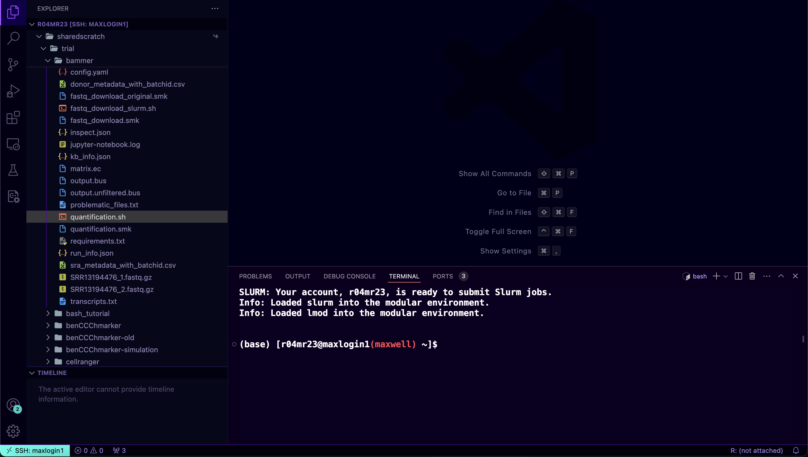
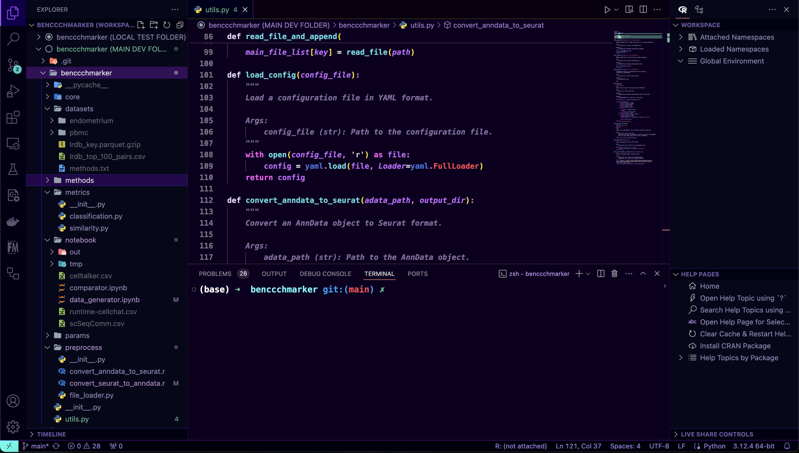

Six months in and you already have multiple folders containing hundreds or even thousand files. Loading all of the folders and files using VSCode remote may take a while now and moving between folders and files might not be as easy as when you have 3 folders. Well, technically for the first problem you can just select one specific folder to work with when you're using VS Code remote, but what if you want to use multiple folders from different parent directory without having to change VS Code windows? Fret not because VS Code have this cool feature called Workspace. It's very straightforward to use Workspace in VS Code.

To start with create a new file called `myworkspace.code-workspace` anywhere on the sharedscratch/home directory. Everything that ends with `.code-workspace` will be interpreted as Workspace by VS Code. The file needs to contain the workspace information in `.json` format. Mainly you will only need to fill the "folders" key with the path of the directory that you want to include in your workspace. For example in my case I want to have both of the folders below in my workspace.

```json
{
	"folders": [
		{
			"path": "/Users/r04mr23/Documents/phd/trial/benCCChmarker",
			"name": "benccchmarker (LOCAL TEST FOLDER)"
		},
		{
			"path": "/Users/r04mr23/Documents/phd/morgan_lab/benccchmarker",
			"name": "benccchmarker (MAIN DEV FOLDER)"
		}
	],
	"settings": {}
}
```

Double clicking the file will automatically open the workspace


There are many keys/parameters that you can put to your `.code-workspace` but right now the above keys should suffice. To learn more about this keys you can refer to the [official page](https://code.visualstudio.com/docs/editor/workspaces).